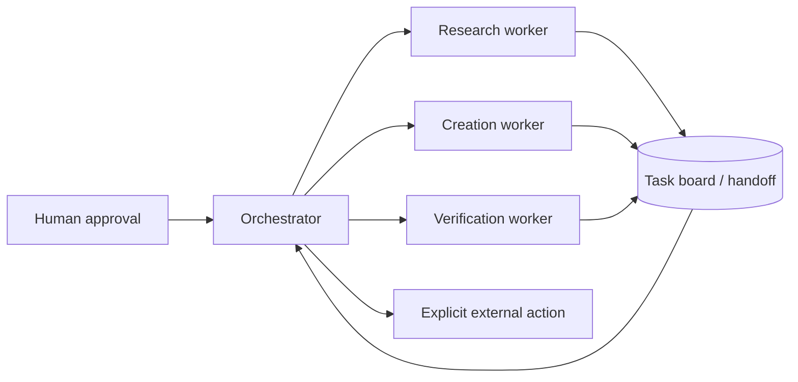

https://github.com/OnkLiam/hermes-team

<div align="center">

# Hermes Team

**Reusable patterns for building small, deliberate multi-agent teams with Hermes Agent.**

[](LICENSE)
[](https://hermes-agent.nousresearch.com/docs)
[](#what-this-repository-is)

</div>

---

## What this repository is

`hermes-team` is a compact starter kit for designing agent teams that are easy to understand, test, and control.

It focuses on the parts that tend to become messy first:

- assigning clear roles to an orchestrator and specialist workers;
- routing tasks through explicit handoffs instead of hidden magic;
- keeping durable project context without dumping whole conversations into memory;
- writing profile and `SOUL.md` files that define boundaries, not just personality;
- making external side effects idempotent, reviewable, and recoverable;
- auditing a Hermes workspace before extracting anything for public use.

This is **not** an official Hermes distribution. It is a set of community-authored patterns that can be copied, adapted, or used as design references.

## The operating model



The important boundary is simple: agents can reason and prepare work, while state-changing actions stay explicit and auditable.

## Included patterns

| Skill | What it covers |
| --- | --- |
| `hermes-multi-agent-architecture` | Roles, routing, shared state, and least-privilege tool surfaces |
| `multi-agent-orchestration` | Task decomposition, Kanban-style handoffs, worker coordination, and verification |
| `hermes-profile-soul-authoring` | Safe, testable profile prompts and `SOUL.md` design |
| `agent-project-brain` | Durable project context, decisions, handoffs, and memory boundaries |
| `external-side-effect-reliability` | Idempotency, claims, leases, ambiguous outcomes, and reconciliation |
| `hermes-open-source-audit` | A practical audit for separating reusable code from private runtime state |

## Install a skill

Copy one skill directory into your Hermes skills directory:

```bash
cp -R skills/multi-agent-orchestration \
  "${HERMES_HOME:-$HOME/.hermes}/skills/"
```

Or copy the whole collection:

```bash
cp -R skills/* "${HERMES_HOME:-$HOME/.hermes}/skills/"
```

Each skill is self-contained in a `SKILL.md` file. Read it before adapting the workflow to another agent framework.

## Design principles

### Explicit beats implicit

A worker should receive a defined task, return a defined artifact, and expose enough state for the orchestrator to verify the result.

### Human approval belongs at the boundary

Drafting, research, classification, and planning can be automated. Sending an email, publishing content, changing infrastructure, or touching a real account should require a deliberate approval step.

### Durable state beats chat archaeology

Important decisions belong in a small project brain or task record. A future worker should not need to replay an entire conversation to understand the current state.

### Recovery is part of the design

A timeout after an external action is not the same as a clean failure. The reliability patterns document how to represent `sending`, `sent`, `ambiguous`, and reconciliation states without creating duplicates.

## Suggested project layout

```text
skills/
├── agent-project-brain/
├── external-side-effect-reliability/
├── hermes-multi-agent-architecture/
├── hermes-open-source-audit/
├── hermes-profile-soul-authoring/
└── multi-agent-orchestration/
```

## Scope and limits

This repository contains generic patterns only. It does not include:

- private Hermes profiles or production prompts;
- provider credentials, `.env` files, channel IDs, or account data;
- a ready-made team configuration for a specific business;
- a guarantee that every pattern fits every Hermes deployment.

Adapt paths, profile names, tools, storage, and approval rules to your own environment.

## License

MIT. Hermes Agent, its documentation, and any third-party tools remain separate projects with their own terms.